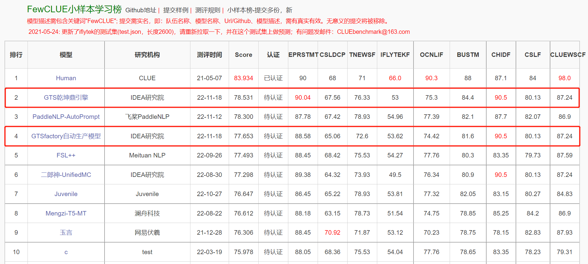

# GTS引擎

<p align="center">
    <a href="./LICENSE"></a>
    <a href=""></a>
    <a href=""></a>
</p>


<h4 align="center">
  <a href=#安装> 安装 </a> |
  <a href=#快速开始> 快速开始 </a> |
  <a href=#API文档> API文档 </a> |
  <a href=#效果展示> 效果展示 </a>
</h4>

------------------------------------------------------------------------------------------

GTS引擎（GTS-Engine）是一款面向工业级生产的开箱即用且性能强大的自然语言理解引擎，聚焦于自然语言理解的小样本任务，能够仅用小样本就能自动化生产NLP模型。

**2022年11月18日，GTS乾坤鼎引擎自动生产的模型夺得中文小样本权威评测基准FewCLUE榜单的冠军，也预示着其模型自动化生产技术已经达到了顶尖的算法专家水平**（详细内容见[效果展示](#效果展示)）。

GTS引擎提出“用AI生产AI”的理念，它基于封神榜开源体系的基础模型，并在下游进行了有监督预训练，同时集成了多种小样本学习技术，搭建了一个模型自动生产的流水线。

GTS-Engine已开源两个系列的引擎，分别为**乾坤鼎**系列和**八卦炉**系列。
- **乾坤鼎**系列是以1.3B参数的大模型为底座，通过大模型结合多种小样本学习技术进行训练和推理的引擎。
- **八卦炉**系列是以110M参数的base模型为底座，融合大模型、数据增强、协同训练等方法进行训练和推理的引擎。

GTS-Engine支持的任务类型：

| 任务类型 | 乾坤鼎 | 八卦炉 |                                             
| ----------- | -------------- |  ---------------- |
| 文本分类     | ✔️支持 | ✔️支持 |
| 句子对相似度  | ✔️支持 | 🚧开发中 |
| 自然语言推理  | ✔️支持 | 🚧开发中 |
| 信息抽取     | ❌暂不支持 | ✔️支持 |
| 关键词生成   | 🚧开发中 | ❌暂不支持 |
| 摘要生成   | ❌暂不支持 | ✔️支持 |

引擎仍在快速迭代中，更多的功能更新请持续关注我们的Github。

您也可以使用我们的**模型自动生产平台**[GTSfactory](https://gtsfactory.com)来训练你的AI模型。无需海量数据，无需算法基础，只需要上传几份小样本的数据集，就能走完从构建数据集到模型训练、下载部署的全流程，帮助中小企业和个人开发者大大减少获得AI模型的成本。我们将逐步开源GTSfactory，让更多的人可以参与到GTS训练体系中来，将IDEA-CCNL坚持的「用AI生产AI」的理念传播开来。

<div align="center">
  
</div>

## 更新日志

- `2023/02/20`：八卦炉增加摘要生成任务，支持以238M、523M参数的模型摘要生成；
- `2022/12/30`：正式发布八卦炉引擎Beta版本，支持以110M参数的base模型为底座的分类、信息抽取类型任务；
- `2022/11/22`：乾坤鼎分类任务增加高级模式：支持用户上传无标注数据进行Self Training，进一步提升效果；
- `2022/11/18`：正式发布乾坤鼎引擎Beta版本，FewCLUE榜单任务训练细节将陆续公开；

## 即将发布

- 更好的使用体验，更清晰的接口，更完善的模块划分，代码快速迭代中；
- 八卦炉引擎分类任务的高级模式，使用大模型生成数据、数据打标进一步提升base模型效果；
- 八卦炉引擎自然语言推理、句子匹配任务；
- 乾坤鼎引擎关键词抽取任务；


## 安装

#### 环境需求和软件依赖

- 软件环境依赖
    - Python >= 3.7
    - 其他依赖请参考`requirements.txt`
- 硬件环境需求
    - 乾坤鼎引擎至少需要一张24G显存的RTX3090，使用V100和A100能够获得更好的性能体验；
    - 八卦炉引擎至少需要一张8G显存的GPU，使用V100和A100能够获得更好的性能体验；

更多环境需求和软件依赖请参考我们的[文档](https://gts-engine-doc.readthedocs.io/en/latest/docs/requirement.html)。

我们提供以下三种安装方式，更详尽的`安装`教程，请参考我们的[文档](https://gts-engine-doc.readthedocs.io/en/latest/docs/quick_start.html)
  - [pip安装](#pip安装)
  - [github安装](#github安装)
  - [Docker安装](#docker安装)

#### pip安装

您可以通过pip直接进行安装。

```bash
# 建议您通过此方式以获得最新的功能体验
pip install git+https://github.com/IDEA-CCNL/GTS-Engine.git
```

或者，

```bash
pip install gts-engine
```

#### github安装

也可以clone下github项目后进行安装。

```bash
git clone https://github.com/IDEA-CCNL/GTS-Engine.git
cd GTS-Engine
python setup.py install
```

#### Docker安装

我们提供一个打包好GTS-Engine的Docker来运行我们的引擎。

```bash
#下载docker
sudo docker pull gtsfactory/gts-engine:v0
```

#### Python SDK

建议您通过我们编写的Python SDK来使用GTS-Engine的服务，请参考[GTS-Engine-Client](https://github.com/IDEA-CCNL/GTS-Engine-Client)。

## 快速开始

我们支持两种方式来使用我们的引擎：通过Web服务的方式和通过命令行调用的方式。更多`快速开始`的详情，请参考我们的[文档](https://gts-engine-doc.readthedocs.io/en/latest/docs/quick_start.html)。

  - [Web服务](#web服务)
  - [调用命令行](#调用命令行)

### 数据预处理

以文本分类任务为例，训练任务中，GTS Engine要求您至少提供三个数据集：训练集、验证集和标签数据，测试集、无标签数据集为可选项。

- **训练数据**

每行是一个样本，采用json格式，数据字段必须含有`"content"`和`"label"`字段, "content"对应的是输入文本，"label"字段对应该文本的标签。

```json
{"content": "佛山市青少年武术比赛开幕，291名武术达人同台竞技", "label": "教育"}
```

- **验证数据**

验证数据与训练数据格式一致。

```json
{"content": "王者荣耀：官方悄悄的降价了4个强势英雄，看来米莱狄要来", "label": "电竞"}
```

- **测试数据**

每行是一个样本，采用json格式，数据字段必须含有`"content"`和`"label"`字段。

```json
{"content": "姚明要建立中国篮球名人堂，哪些人可以入围？", "label": "体育"}
```

- **无标签数据**

每行是一个样本，采用json格式，数据字段必须含有`"content"`字段。

```json
{"content": "挥不去的是记忆，留不住的是年华，拎不起的是失落"}
```

- **标签数据**

数据为json格式，只有一行数据，必须含有"labels"字段，对应的是标签的列表集合。

```json
{"labels": ["故事", "文化", "娱乐", "体育", "财经", "房产", "汽车", "教育", "科技", "军事", "旅游", "国际", "股票", "农业", "电竞"]}
```

其他任务的数据预处理要求，请参考我们的[文档](https://gts-engine-doc.readthedocs.io/en/latest/docs/preprocess.html)。

### Web服务

GTS引擎通过调用`gts_engine_service`脚本启动一个FastAPI Web服务，通过向服务发送HTTP Post请求，即可无需了解算法细节零门槛进行训练和推理，您还可以结合我们提供的Python SDK（[GTS-Engine-Client](https://github.com/IDEA-CCNL/GTS-Engine-Client)）来更方便地调用服务。下面以examples中的文本分类任务为例，教您如何快速使用引擎。

#### 启动服务

- 您可以直接通过调用命令行启动GTS-Engine的服务。

```bash
mkdir pretrained  #将下载好的模型文件放在pretrained
mkdir tasks
#pip安装方式    启动
CUDA_VISIBLE_DEVICES=0 gts_engine_service --task_dir tasks --pretrained_dir pretrained --port 5201 
#github安装方式 启动
CUDA_VISIBLE_DEVICES=0 python gts_engine_service.py --task_dir tasks --pretrained_dir pretrained --port 5201 

```

- 同时也可以通过我们已安装的Docker直接运行我们的服务。

```bash
#docker安装方式 启动
#--mount 注：目录挂载source对应的必须是存在的本地绝对路径
#-p 本地端口与docker端口映射
sudo docker run -it --name gts_engine \
-p 5201:5201 \
--mount type=bind,source=/usr/tasks,target=/workspace/GTS-Engine/tasks \
gtsfactory/gts-engine:v0
#更新代码
cd GTS-Engine
git pull
cd gts_engine
#启动服务
CUDA_VISIBLE_DEVICES=0 python gts_engine_service.py --port 5201
```

#### 开始训练

结合GTS-Engine-Client，您可以仅通过八行代码即可完成模型的训练。

```python
from gts_engine_client import GTSEngineClient
#ip和port参数与启动服务的ip和port一致
client = GTSEngineClient(ip="192.168.190.2", port="5201")

# 创建任务
client.create_task(
  task_name="tnews_classification",
  task_type="classification",
  engine_type="qiankunding")

# 上传文件  注：要上传的文件地址写绝对路径
client.upload_file(
  task_id="tnews_classification",
  local_data_path="examples/text_classification/tnews_train.json")
client.upload_file(
  task_id="tnews_classification",
  local_data_path="examples/text_classification/tnews_val.json")
client.upload_file(
  task_id="tnews_classification",
  local_data_path="examples/text_classification/tnews_test.json")
client.upload_file(
  task_id="tnews_classification",
  local_data_path="examples/text_classification/tnews_label.json")

# 开始训练
client.start_train(
  task_id="tnews_classification",
  train_data="tnews_train.json",
  val_data="tnews_val.json",
  test_data="tnews_test.json",
  label_data="tnews_label.json",
  train_mode="standard",
  max_num_epoch=1,
  min_num_epoch=1, 
  seed=42, 
  gpuid=0)
```

#### 开始推理

同样地，您也可以在训练完成后，仅使用三行代码完成推理。

```python
from gts_engine_client import GTSEngineClient
# 加载已训练好的模型
client.start_inference(task_id="tnews_classification")
# 预测
client.inference(
  task_id="tnews_classification",
  samples=[
    {"content":"怎样的房子才算户型方正？"},
    {"content":"文登区这些公路及危桥将进入 封闭施工，请注意绕行！"}
  ])
```

### 调用命令行

我们也支持直接通过命令行的方式进行训练和推理，适合了解算法的高阶使用者。

#### 开始训练

```bash
usage: gts_engine_train.py [-h]
                          --task_dir TASK_DIR
                          --engine_type ENGINE_TYPE
                          --task_type TASK_TYPE
                          [--num_workers NUM_WORKERS]
                          [--train_batchsize TRAIN_BATCHSIZE]
                          [--valid_batchsize VALID_BATCHSIZE]
                          [--test_batchsize TEST_BATCHSIZE]
                          [--max_len MAX_LEN]
                          --pretrained_model_dir PRETRAINED_MODEL_DIR 
                          --data_dir DATA_DIR --train_data TRAIN_DATA 
                          --valid_data VALID_DATA
                          [--test_data TEST_DATA]
                          [--label_data LABEL_DATA]
                          [--save_path SAVE_PATH]
                          [--seed SEED]
                          [--lr LR]
                          [--max_epochs MAX_EPOCHS]
                          [--min_epochs MIN_EPOCHS]
```

您可以通过`-h`查看详细的参数说明，也可以通过`examples/text_classification/run_train_qiankunding.sh`直接运行训练示例。

#### 开始推理

```bash
usage: gts_engine_inference.py [-h] --task_dir TASK_DIR --engine_type {qiankunding,bagualu} --task_type {classification,similarity,nli} --input_path INPUT_PATH --output_path OUTPUT_PATH

optional arguments:
  -h, --help            show this help message and exit
  --task_dir TASK_DIR   specific task directory
  --engine_type {qiankunding,bagualu}
                        engine type
  --task_type {classification,similarity,nli}
                        task type for training
  --input_path INPUT_PATH
                        input path of data which will be inferenced
  --output_path OUTPUT_PATH
                        output path of inferenced data
```

您可以通过`examples/text_classification/run_inference_qiankunding.sh`直接运行推理示例。

### 分类任务-标签检测

标签检测是一个检测分类任务输入标签的效果的功能，它的作用是判断标签对于文本数据内容的概括性，并且给出分数和评级，依据该分数和评级可以在分类任务之前对标签的性能进行评判，预先将对文本内容概括性差的标签进行相应的修改、删除操作，由此提升后续分类任务的效果。

- **输入-标签数据**

输入数据目录为`gts_engine/examples/text_classification`，示例文件的文件名为`tnews_label`，数据为json格式，只有一行数据，必须含有`"labels"`字段，对应的是标签的列表集合，输入格式示例如下，使用时可直接将示例文件内的数据进行替换。

```json
{"labels": ["故事", "文化", "娱乐", "体育", "财经", "房产", "汽车", "教育", "科技", "军事", "旅游", "国际", "股票", "农业", "电竞"]}
```

- **输入-数据集**

目录与标签数据同级，示例文件的文件名为`tnews_test`，每行是一个样本，只需要一个数据输入文件，输入数据采用json格式，数据必须含有`"content"`和`"label"`字段，`"content"`对应的是输入文本，`"label"`字段对应该文本的标签。输入格式示例如下，使用时可直接将示例文件内的数据进行替换。

```json
{"content": "请替我活下去：6岁女孩身患重病，自愿捐所有器官救5人，万人泪湿", "label": "故事", "id": 2740}
```

#### 开始检测
一行代码启动.py文件即可开始检测

```bash
python label_detection.py --label_path ../../examples/text_classification/tnews_label.json --data_path ../../examples/text_classification/tnews_test.json
```

## API文档

更多GTS-Engine的内容可参考[API文档](https://gts-engine-doc.readthedocs.io/en/latest/index.html)。

## 效果展示

在众多真实的业务场景中，有标注的数据是往往是严重稀缺的，而相关数据的获取和标注需要大量的人力和专家知识的投入。因此，小样本学习的研究已经成为业界的热点之一。GTS-Engine将专注于解决各种小样本自然语言理解任务。乾坤鼎引擎通过一套训练流水线，已经达到了人类算法专家的水准。2022年11月18日，GTS乾坤鼎引擎在中文语言理解权威评测基准FewCLUE榜单上登顶。其中，在EPRSTMT(电商评论情感二分类)任务中超过了其他算法专家生产的模型，同时也刷新了 BUSTM(句子对相似度判断)任务的记录。GTS-Engine系列会持续在各个NLU任务上不断优化，持续集成，带来更好的开箱即用的体验。



## GTS大事件

- [开源引擎GTS乾坤鼎：自动生产模型拿下FewCLUE榜单冠军](https://mp.weixin.qq.com/s/uDMuf0HXanPCM26WFfdvDw) 2022.11.18
- [IDEA研究院GTSfactory入选信通院首批大模型优秀应用案例](https://mp.weixin.qq.com/s/bYwPsmJsGehCABWs8nC9SQ) 2022.08.30
- [GTS模型生产平台开放公测，用AI自动化生产AI模型](https://mp.weixin.qq.com/s/AFp22hzElkBmJD_VHW0njQ) 2022.05.23

## 相关链接

- [封神榜官网](https://fengshenbang-lm.com)
- [封神榜Huggingface](https://huggingface.co/IDEA-CCNL)
- [封神榜模型体验中心](https://demo.fengshenbang-lm.com)
- [封神框架](https://github.com/IDEA-CCNL/Fengshenbang-LM)
- [GTS模型自动生产平台](https://gtsfactory.com)
- [CCNL技术团队知乎账号-封神空间](https://www.zhihu.com/people/feng-shen-kong-jian)


## 引用

如果您在研究中使用了我们的工具，请引用我们的工作：

```
@misc{GTS-Engine,
  title={GTS-Engine},
  author={IDEA-CCNL},
  year={2022},
  howpublished={\url{https://github.com/IDEA-CCNL/GTS-Engine}},
}
```

## 联系我们

IDEA研究院CCNL技术团队已创建封神榜+GTS开源讨论群，我们将在讨论群中不定期更新发布GTS新特性、封神榜新模型与系列技术文章。请扫描下面二维码或者微信搜索“fengshenbang-lm”，添加封神空间小助手进群交流！


我们也在持续招人，欢迎投递简历！


## 开源协议

GTS-Engine遵循[Apache-2.0开源协议](https://github.com/IDEA-CCNL/GTS-Engine/blob/main/LICENSE)。
